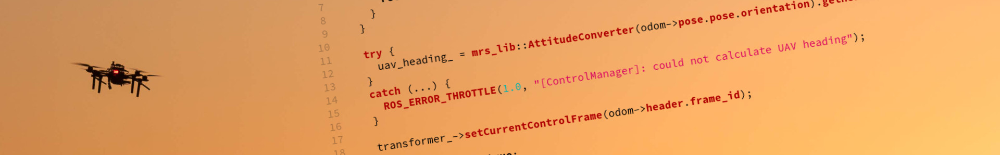

# MRS libraries

| Build status |  |  |
|--------------|------------------------------------------------------------------------------------------------------------------------------|----------------------------------------------------------------------------------------------------------------------------|

## Overview

This ROS package contains various useful libraries (mostly C++) for the [MRS UAV system](https://github.com/ctu-mrs/mrs_uav_system).

* Online documentation: [https://ctu-mrs.github.io/mrs_lib](https://ctu-mrs.github.io/mrs_lib).

## Notable libraries:

* **ParamLoader** - wrapper around ROS's param loading for C++ ([documentation](https://ctu-mrs.github.io/mrs_lib/classmrs__lib_1_1ParamLoader.html))
* **Transformer** - wrapper around ROS's transfomation library ([documentation](https://ctu-mrs.github.io/mrs_lib/classmrs__lib_1_1Transformer.html))
* **SubscribeHandler** - wrapper around ROS's subscriber ([documentation](https://ctu-mrs.github.io/mrs_lib/classmrs__lib_1_1SubscribeHandler.html))
* **AttitudeConverter** - a proxy class for converting representations of 3D orientation ([documentation](https://ctu-mrs.github.io/mrs_lib/classmrs__lib_1_1AttitudeConverter.html))
* **LKF** - Linear Kalman Filter ([documentation](https://ctu-mrs.github.io/mrs_lib/classmrs__lib_1_1LKF.html))
* **UKF** - Unscented Kalman Filter ([documentation](https://ctu-mrs.github.io/mrs_lib/classmrs__lib_1_1UKF.html))
* **Repredictor** - algorithm for fusing variably time-delayed measurements ([documentation](https://ctu-mrs.github.io/mrs_lib/classmrs__lib_1_1Repredictor.html))
* **Profiler** - scoped profiling routine ([documentation](https://ctu-mrs.github.io/mrs_lib/classmrs__lib_1_1Profiler.html))
